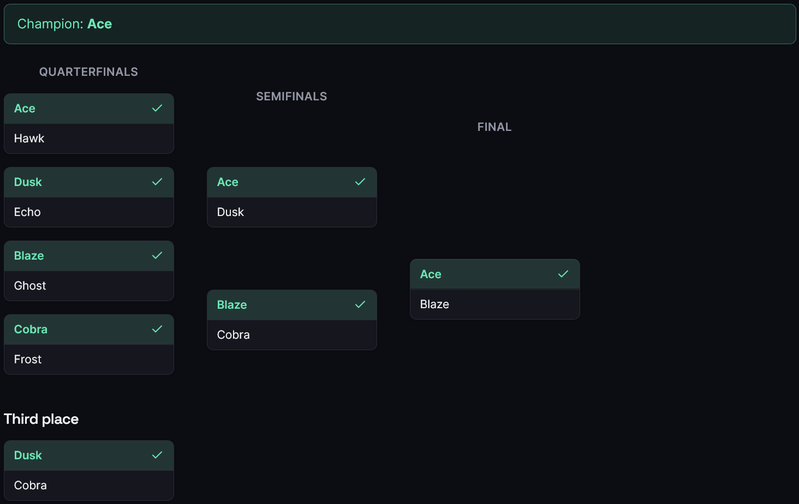
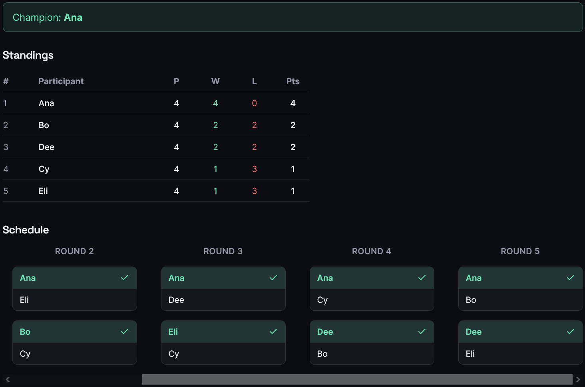

# Tournament Organizer


A web app for running game-night and esports tournaments. Make a tournament, add
players, pick a format, and click the winner as each game finishes. It builds the
bracket, keeps score, and pushes updates live to anyone watching.

## Screenshots




## Formats

- **Single elimination** with seeding and byes for any number of players.
- **Double elimination** with a losers bracket, a grand-final reset, and byes
  for any player count.
- **Round robin** where everyone plays everyone, ranked in a standings table.
- **Swiss** that pairs players on similar records each round and avoids rematches.

## What it does

You run the whole thing from one screen. Click a winner and the bracket fills in;
anyone watching the spectator link sees it change without refreshing (and the
live feed reconnects on its own if the connection blips).

Matches can be a single game or best of 3/5/7, and you can record the game
scores. Mis-clicked a result? Fix it, and the change propagates back through the
bracket when that's safe to do. While a tournament is still a draft you can
rename or remove players, drag them to set seeds, or delete the whole thing.

A few extras: participants can be teams with their own rosters, single
elimination can add a third-place match, you can save a bracket or standings
table as a PNG, and there's a stats page with each participant's win/loss/title
record across your tournaments. Themes are light or dark with a pickable accent
color.

## Stack

FastAPI, SQLAlchemy, and Postgres on the backend (SQLite locally), with Alembic
migrations and JWT auth. The frontend is React, TypeScript, Vite, and Tailwind.
Live updates go over WebSockets. Tests are pytest and Vitest, linting is
ruff/black, CI runs on GitHub Actions, and the whole stack runs in Docker.

## Running it

With Docker:

```bash
docker compose up --build
```

That starts Postgres, runs migrations, and serves everything — frontend on
http://localhost:5173, API docs on http://localhost:8000/docs.

To run the pieces yourself, start the backend (Python 3.11+, Poetry):

```bash
cd backend
poetry install
poetry run alembic upgrade head
poetry run uvicorn app.main:app --reload
```

and the frontend (Node 20+):

```bash
cd frontend
npm install
npm run dev
```

The frontend talks to http://localhost:8000 by default; set `VITE_API_BASE_URL`
to point it elsewhere.

## Tests

```bash
cd backend && poetry run pytest --cov=app   # ~150 backend tests
cd frontend && npm test                     # Vitest + React Testing Library
```

The backend tests cover the bracket math for all four formats plus scoring,
seeding, stats, the API, auth, and the live feed. The frontend has component and
API-client tests. Both run in CI.

## How it's put together

Each format is a small strategy behind one interface, so the pairing and seeding
math is plain functions with no database in them — easy to test, and adding a
format doesn't touch the API or UI. There's a longer write-up in
[docs/ARCHITECTURE.md](docs/ARCHITECTURE.md).

```
api  ->  services (bracket engine + formats)  ->  crud  ->  models / db
```

```
backend/    FastAPI app (api / services / crud / schemas / models), Alembic, tests
frontend/   React + TS app (pages / components / api client / auth / hooks)
docs/       product notes, architecture, backlog
```

See also [docs/PRODUCT.md](docs/PRODUCT.md) and [docs/BACKLOG.md](docs/BACKLOG.md).

## Notes

Every format handles any number of players; elimination brackets pad up to a
power of two with byes. Change `SECRET_KEY` before deploying anywhere real — the
default is only meant for local use.

## License

[MIT](LICENSE) © kian3158
